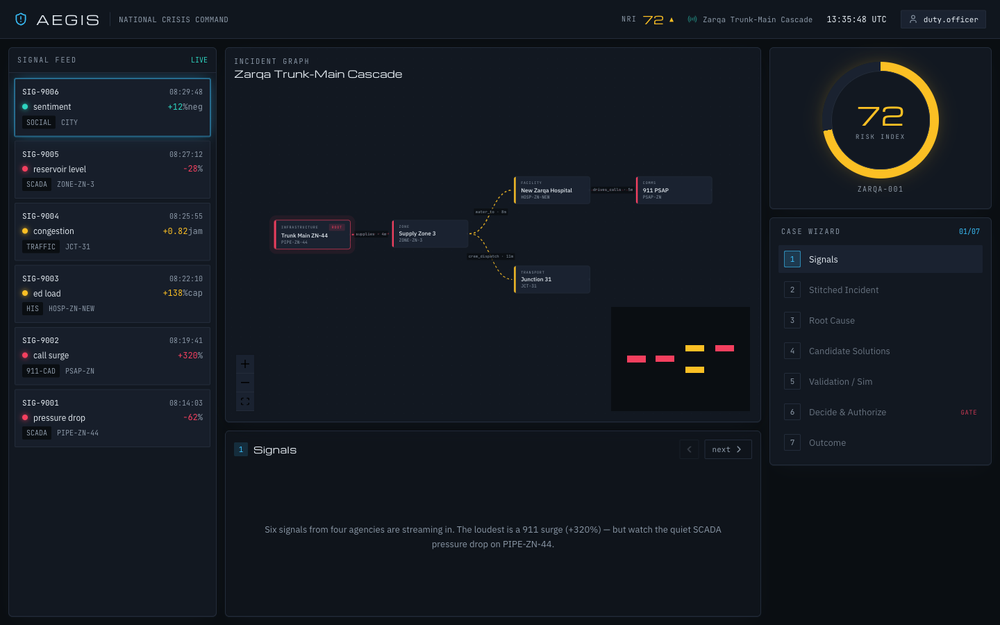
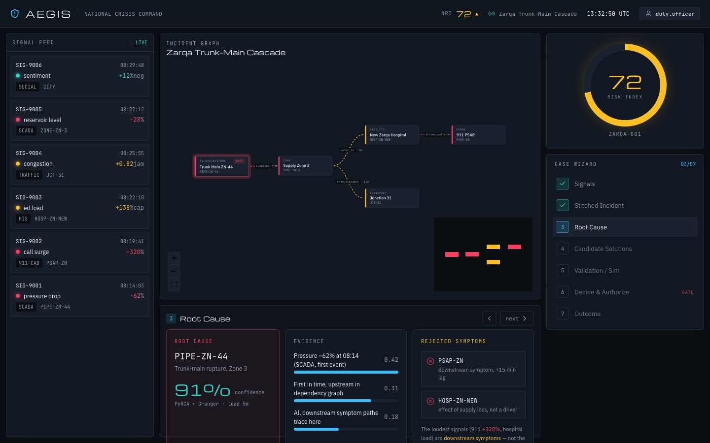
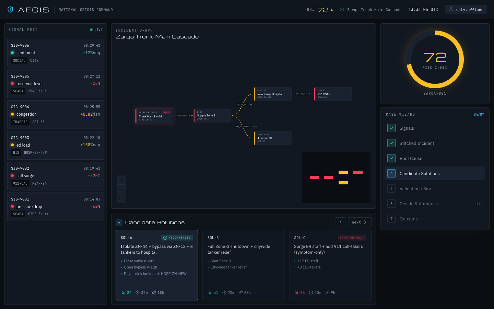
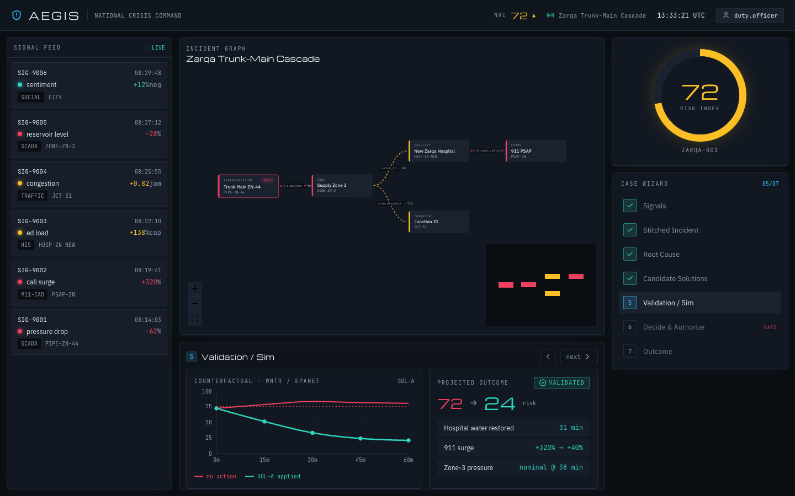
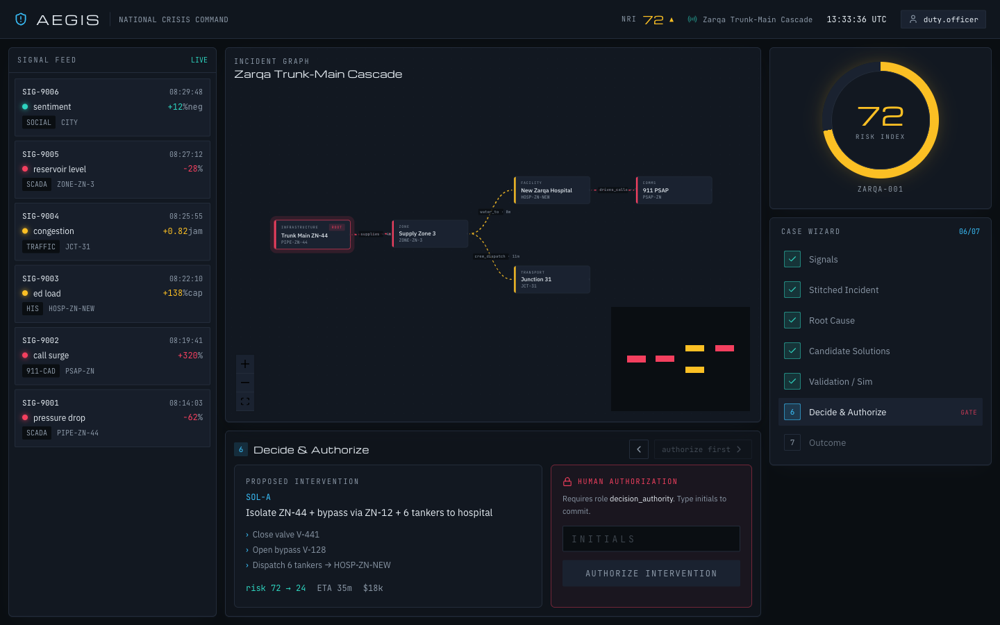
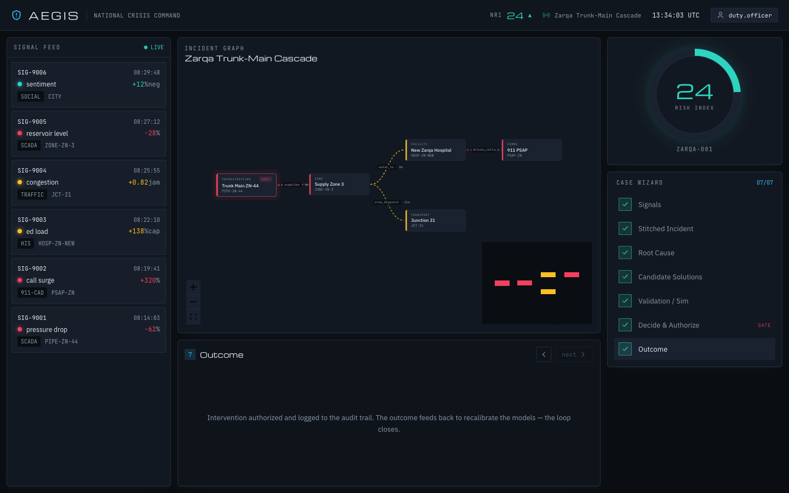

# AEGIS — General Crisis-Solving Brain

> A graph-based, deer-flow-style multi-agent system that takes **any** crisis case, connects every signal in a dependency graph, finds the **root cause**, and produces a **validated solution** — demonstrated end-to-end on the *Jordan Crisis Management Simulation Engine* scope, with a working React command-center dashboard.

This repository contains the full body of work: a specification gap analysis, a domain-agnostic system blueprint, a technical engine spec, a deep System Requirements document, an MVP definition, and a **running frontend** — the **AEGIS National Crisis Command** dashboard.

---

## The dashboard (live MVP UI)

The **AEGIS** dashboard walks a duty officer through a crisis case via a 7-step wizard: raw signals → stitched incident graph → root cause → candidate solutions → simulation/validation → human authorization → outcome. It runs entirely on the embedded Zarqa fixtures (no backend required).

### 1 · Cockpit — signals streaming in
The command center: live signal feed (left), the incident dependency graph (center, root node ringed in red), the National Risk Index gauge and case wizard (right).



### 2 · Root Cause — symptom vs. cause
Backward causal traversal names **PIPE-ZN-44** (the trunk-main rupture) the root cause at **91% confidence**, and explicitly **rejects** the loud 911 surge and hospital load as downstream *symptoms*.



### 3 · Candidate Solutions
Interventions that act on the **cause**, ranked. The recommended fix (isolate + bypass + tankers) is highlighted; the "surge the ER" option is flagged *symptom-only*.



### 4 · Validation — counterfactual simulation
Each candidate is re-simulated on the hydraulic twin. A solution is **valid** only if it drops the risk index vs. no action: **72 → 24**, VALIDATED.



### 5 · Decision Gate — human authorization
A hard human-in-the-loop gate: a `decision_authority` must type their initials to commit. Nothing is tasked automatically.



### 6 · Outcome — the loop closes
Intervention authorized and logged to the audit trail; the risk index settles at **24** and the outcome feeds back to recalibrate the models.



---

## Run the frontend

```bash
cd frontend
npm install
npm run dev
# open http://localhost:5173
```

Built with **React 18 + TypeScript · Vite · Tailwind CSS · React Flow · Framer Motion · Recharts**. No backend needed — it ships with the Zarqa demo fixtures in `src/data/zarqa.ts`.

---

## Documentation

All design and specification documents live in [`docs/`](docs/) (Markdown + rendered PDF).

| Document | What it is |
|---|---|
| [`GENERAL_CRISIS_BRAIN_BLUEPRINT`](docs/GENERAL_CRISIS_BRAIN_BLUEPRINT.md) | The domain-agnostic, deer-flow-style brain: Domain-Pack architecture, solver swarm, multi-domain proof, verified tech stack |
| [`Crisis_Intelligence_Core_Technical_Spec`](docs/Crisis_Intelligence_Core_Technical_Spec.md) | The engine spec: event correlation/stitching, root-cause analysis, National Risk Index cascade — with algorithms + the Zarqa worked example |
| [`SYSTEM_REQUIREMENTS`](docs/SYSTEM_REQUIREMENTS.pdf) | Software Requirements Specification (React + Python + PostgreSQL): 96 functional + 42 non-functional requirements, architecture, data design, API, security |
| [`MVP`](docs/MVP.md) | MVP scope, the dashboard-wizard walkthrough, full-stack architecture, API, PostgreSQL schema |
| [`FRONTEND_BUILD`](docs/FRONTEND_BUILD.md) | How the frontend is built — design system, screens, wizard, and a ready-to-paste Claude Design prompt |
| [`TECH_STACK`](docs/TECH_STACK.md) | The complete technology stack across every layer |
| [`GAP_ANALYSIS_REPORT`](docs/GAP_ANALYSIS_REPORT.pdf) / [`SUMMARY`](docs/GAP_ANALYSIS_SUMMARY.pdf) | Gap analysis of the original scope (28 confirmed gaps) — full + condensed |

---

## How it works

The brain runs one domain-agnostic loop; a **Domain Pack** (ontology, propagation rules, connectors, intervention library, simulator) plugs in per domain — water is one pack, public-health and power-grid are others.

```
Ingest → Resolve → Correlate → Root-Cause → Risk → Generate-Solution → Validate → Recommend → Learn
   │         │          │           │          │            │              │           │         │
 signals  entity     stitch     causal-     cascade     intervention    re-sim     human     outcome
          resolution  incident   graph apex  propagate   library        on graph   gate      feedback
```

A **deer-flow-style agent swarm** drives it: *coordinator → planner → [graph-builder · correlator · root-cause · solution-generator · simulator-validator] → adversarial critic → human gate → reporter*, on a LangGraph runtime.

**A solution is "valid"** iff it (a) targets the root cause not symptoms, (b) is simulated to reduce the risk index, (c) is feasible (resources/authority/time), (d) bounds second-order harm, and (e) carries confidence + evidence lineage.

---

## Tech stack

| Layer | Technology |
|---|---|
| **Frontend** | React 18 + TypeScript · Vite · Tailwind CSS · shadcn/ui · React Flow · Framer Motion · Recharts · MapLibre GL |
| **Backend / API** | Python 3.12 · FastAPI (REST + WebSocket) · Pydantic v2 · SQLAlchemy 2 + Alembic · Celery/Arq |
| **Agent swarm** | LangGraph (deer-flow pattern) |
| **Engines** | networkx/rustworkx · Splink/dedupe · DoWhy/causal-learn/PyRCA · PyOD/river · Mesa/PySD + WNTR/EPANET · OR-Tools |
| **Data** | PostgreSQL 16 + Apache AGE (graph) · pgvector · PostGIS · TimescaleDB · Redis · S3/MinIO |
| **Infra** | Docker + compose · GitHub Actions · OAuth2/OIDC + RBAC · OpenTelemetry |

See [`docs/TECH_STACK.md`](docs/TECH_STACK.md) for the full breakdown with verified open-source repos.

---

## Repository layout

```
crisis/
├── README.md
├── frontend/        # AEGIS React dashboard (the running MVP UI)
├── docs/            # blueprint, technical spec, SRS, MVP, frontend, tech stack, gap analysis
├── screenshots/     # dashboard captures (the images above)
└── Jordan Crisis Management Simulation Engine.pdf   # the original scope package
```
