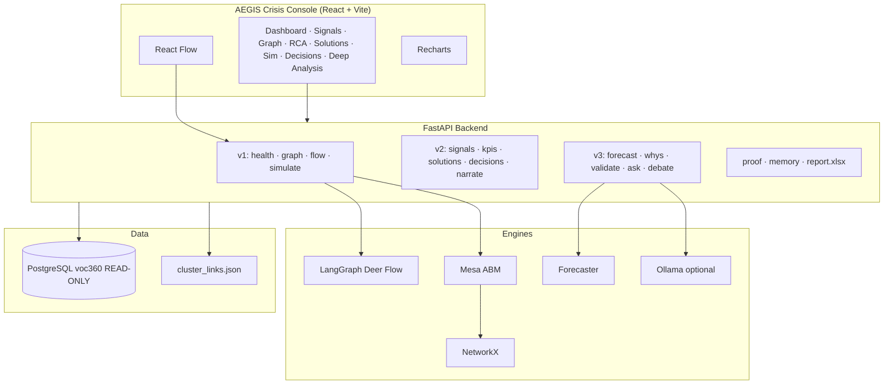

# AEGIS — Jordan Crisis Management Simulation Engine

> A graph-based, deer-flow-style crisis intelligence system that connects every signal in a dependency graph, finds the **root cause** (not the loudest symptom), drafts a **validated solution**, and **simulates** impact before a human acts — demonstrated on the Jordan Crisis Management Simulation Engine scope with a live **AEGIS Crisis Console**.

[](frontend/)
[](backend/)
[](docs/VOC360_SCHEMA.md)

---

## Table of contents

- [What is this project?](#what-is-this-project)
- [Why it exists](#why-it-exists)
- [What you get](#what-you-get)
- [Screenshots](#screenshots)
- [How it works](#how-it-works)
- [Features](#features)
- [Technology stack](#technology-stack)
- [Architecture](#architecture)
- [Data sources](#data-sources)
- [API reference](#api-reference)
- [Quick start](#quick-start)
- [Configuration](#configuration)
- [Repository layout](#repository-layout)
- [Documentation](#documentation)
- [Design principles](#design-principles)
- [Roadmap](#roadmap)

---

## What is this project?

**AEGIS** (Automated Evidence-Grounded Incident System) is a **general crisis-solving brain** packaged as an operator command center. It ingests citizen and operational **signals**, builds a live **dependency graph**, ranks **root-cause problem clusters**, proposes **interventions**, **validates** them against evidence and simulation, and supports **human decision** logging.

This repository is the full deliverable for the **Jordan Crisis Management Simulation Engine**:

| Deliverable | Location |
|-------------|----------|
| **Running UI** — AEGIS Crisis Console | [`frontend/`](frontend/) |
| **Live API** — Deer Graph backend | [`backend/`](backend/) |
| **Specifications** — SRS, blueprint, gap analysis, tech stack | [`docs/`](docs/) |
| **Original scope package** | `Jordan Crisis Management Simulation Engine.pdf` |

The system is **domain-agnostic by design**: a **Domain Pack** (ontology, connectors, propagation rules, intervention library, simulator) plugs in per crisis type. **Water** is demonstrated via the Zarqa pipe-rupture narrative; **public services** are demonstrated via live Jordanian **voc360** Voice-of-Customer data.

---

## Why it exists

During a crisis, operators are flooded by **loud downstream symptoms** — e.g. a +320% spike in 911 calls — while the **quiet upstream failure** (e.g. a trunk-main pressure drop on `PIPE-ZN-44`) is easy to miss. Volume-based dashboards reinforce the wrong priority.

AEGIS inverts that logic:

1. **Graph** — Wire sources → services → regions → problem clusters so causality is visible.
2. **Root cause** — Rank clusters by evidence strength, not alert volume.
3. **Validate** — Score whether a fix targets the apex, has coverage, is feasible, and reduces simulated risk.
4. **Simulate** — Model propagation with vs without intervention before authorization.
5. **Ground** — Every number and label is retrieved from SQL; optional local LLM only **phrases** facts, never invents them.

---

## What you get

### Two operating modes

| Mode | Data | Backend required? | Best for |
|------|------|-------------------|----------|
| **Demo (Zarqa)** | Static fixtures in `frontend/src/lib/data.ts` | No | Offline demos, water-crisis narrative |
| **Live (voc360)** | Read-only PostgreSQL `voc360` (~22k signals) | Yes + `VOC_DSN` | Real Jordan government complaint graph |

### Console pages (sidebar)

| Page | Purpose |
|------|---------|
| **Dashboard** | KPIs, signal-volume chart, signals table, **Run Analysis** |
| **Signals** | Paginated citizen complaint feed from `the_data` |
| **Incident Graph** | Interactive React Flow graph + Deer Graph stages + Mesa simulation |
| **Root Cause** | Ranked RIL problem clusters + recommendations |
| **Solutions** | Cause → countermeasure → feasibility → expected impact |
| **Simulation** | Before/after risk curves (intervention vs no action) |
| **Decisions** | Operator decision log (audit trail) |
| **Deep Analysis** | Forecasts, why-chains, validation, Q&A, multi-agent debate |

---

## Screenshots

### Dashboard (Zarqa demo or live KPIs)


KPI examples in demo mode: National Risk, Apex Confidence (PyRCA narrative), Projected Risk after validated fix, Time to Mitigate.


### Live Deer Graph (voc360)


22k+ citizen signals across 150+ services, RIL root-cause clusters (urgent-service fees, BRT bus, National Aid delays, Takaful platform, etc.).

| Page | Screenshot |
|------|------------|
| Signals | [`screenshots/page-signals.png`](screenshots/page-signals.png) |
| Root Cause | [`screenshots/page-rootcause.png`](screenshots/page-rootcause.png) |
| Solutions | [`screenshots/page-solutions.png`](screenshots/page-solutions.png) |
| Deep Analysis | [`screenshots/page-deep-analysis.png`](screenshots/page-deep-analysis.png) |

---

## How it works

### The crisis loop (domain-agnostic)

```
Ingest → Resolve → Correlate → Root-Cause → Risk → Generate-Solution → Validate → Recommend → Learn
   │         │          │           │          │            │              │           │         │
 signals  entity     stitch     causal-     cascade     intervention    re-sim     human     outcome
          resolution  incident   graph apex  propagate   library        on graph   gate      feedback
```

A **deer-flow-style agent swarm** (ByteDance [deer-flow](https://github.com/bytedance/deer-flow) pattern on **LangGraph**) orchestrates the live pipeline:

```
connect → ingest → graph → rootcause → recommend
```

Optional stages: narrate (local LLM), simulate (Mesa ABM), debate (multi-agent Arabic personas).

### Zarqa water demo (why the story matters)

A modeled **trunk-main rupture** (`PIPE-ZN-44`) in Zarqa cascades into hospital load, traffic, and a **911 surge**. The brain must show that the surge is a **symptom** (high Z-score, downstream) while the pipe pressure drop is the **apex** (quiet, upstream). The validated fix: isolate + bypass + tanker dispatch — risk 84 → 22 in the narrative.

### Live voc360 pipeline (why the graph is real)

Government **Voice-of-Customer** data lives in PostgreSQL:

```
the_data (signals)
    └── service_id, source_type, governorate, severity, sentiment, Arabic text

ril_text_segments → ril_cluster_members → ril_problem_clusters (RIL root-cause layer)
```

**Problem:** RIL `record_id` does not join `the_data` (separate snapshot).

**Solution (Track 1 — text recovery):** Each segment text is a **substring** of a real signal row. `cluster_link.py` recovers `Service → Cluster` edges by matching text — no re-embedding, no cloud API key. Cached in `backend/data/cluster_links.json` for offline graph builds.

**Root-cause ranking:**

```
score = member_count × (0.5 + severity_avg)
```

### Valid solution criteria

A solution is **valid** when it:

1. Targets the **root cause**, not symptoms  
2. **Reduces** simulated or projected risk  
3. Is **feasible** (resources, authority, time)  
4. **Bounds** second-order harm  
5. Carries **confidence + evidence lineage**

---

## Features

### 1. Dashboard & KPIs

- Aggregates real `the_data` when backend is connected: signal totals, critical %, negativity ratio.
- **Signal volume** time series (Recharts) per selected service/case.
- Falls back to Zarqa demo fixtures when API is unreachable.

**Tech:** React, Recharts, `api_kpis.py`, `api_signals.py`.

### 2. Deer Graph — Run Analysis

Streams **NDJSON** stages to the UI modal:

| Stage | Action |
|-------|--------|
| `connect` | Read-only voc360 health check |
| `ingest` | Pull signals for case/service |
| `graph` | Build Source → Service → Governorate + clusters |
| `rootcause` | Rank RIL clusters |
| `recommend` | Draft intervention text |

**Tech:** FastAPI `StreamingResponse`, **LangGraph** `StateGraph` in `deer_flow.py` (pure-Python fallback if LangGraph missing).

### 3. Incident Graph

- **React Flow** canvas: sources, services, governorates, problem clusters.
- Real `root_cause` edges from `cluster_link` (keyword heuristic fallback only if cache/DB absent).
- Inline **simulation** chart (Mesa or lightweight risk model).
- **Proof panel** drill-down per cluster.

**Tech:** React Flow (`@xyflow/react`), `graph_builder.py`, `LiveGraph.tsx`, `ProofPanel.tsx`.

### 4. Root Cause & Solutions

- **Root Cause:** Top clusters with Arabic labels + English gloss (build-time translation map).
- **Solutions:** Deterministic cause → countermeasure templates (`solutions.py`).

**Tech:** `rootcause.py`, SQL on `ril_problem_clusters`.

### 5. Simulation (Mesa ABM)

- One **agent per graph node**; weighted sentiment contagion + decay.
- **Intervention** dampens the dominant cluster/service node.
- **Before/after** time series returned to UI.

**Tech:** **Mesa 3**, **NetworkX**, numpy; pure-Python fallback in `main.py` if Mesa unavailable.

### 6. Deep Analysis (v3)

| Capability | Endpoint | Engine |
|------------|----------|--------|
| Suggested questions | `GET /api/suggest` | Context templates |
| Why chain | `POST /api/whys` | Layered causal chain |
| Root-cause subgraph | `GET /api/rootcause-graph` | Graph traversal |
| Forecast | `GET /api/forecast` | Holt-Winters / seasonal naive; optional TimesFM |
| Escalations | `GET /api/forecast/escalations` | Trend scan |
| Validation | `GET /api/validate` | 4-axis grounded score |
| Ask | `POST /api/ask` | Retrieve facts → optional Ollama phrasing |
| Debate | `POST /api/debate` | Analyst / Advocate / Skeptic / Synthesizer (Arabic, NDJSON) |

**Tech:** `api_v3.py`, `forecaster.py`, `whys.py`, `validate.py`, `qa.py`, `debate.py`, `llm.py`.

### 7. Proof & Excel reports

- `GET /api/proof` — Composes why-chain, validation, evidence quotes, forecast snippet.
- `GET /api/report/{cluster_id}.xlsx` — 4-sheet workbook (Summary, Why-Chain, Evidence, Related Cases).

**Tech:** `proof.py`, **openpyxl**.

### 8. LightMem (institutional memory)

Lightweight adaptation of cognitive memory (compress segments → topic entries → hybrid retrieval for debate/Q&A prompts). No Qdrant/torch required.

**Tech:** `memory_light.py` — `GET /api/memory`, `POST /api/memory/rebuild`.

### 9. Local LLM (optional)

- **Ollama** or any OpenAI-compatible `http://localhost:11434/v1` endpoint.
- Used for narration, Q&A phrasing, multi-agent debate — **never** as the source of counts or causes.
- Deterministic Arabic/English fallback when LLM is down.

**Env:** `LLM_BASE_URL`, `LLM_MODEL`, `LLM_TIMEOUT`.

---

## Technology stack

### Implemented in this repository (running MVP)

| Layer | Technology | Version (pinned / used) | Why |
|-------|------------|---------------------------|-----|
| **UI framework** | React + TypeScript | React 19, TS 6 | Component model, type-safe console |
| **Bundler** | Vite | 8.x | Fast dev server, HMR |
| **Styling** | Tailwind CSS | 3.4 | Design tokens, dark command-center theme |
| **Icons** | lucide-react | 1.x | Consistent iconography |
| **Graph UI** | React Flow (`@xyflow/react`) | 12.x | Interactive dependency graph |
| **Charts** | Recharts | 3.x | KPI, volume, simulation, forecast charts |
| **Animation** | Motion (Framer) | 12.x | Transitions, onboarding |
| **Client state** | Zustand | 5.x | Theme, wizard state |
| **API** | FastAPI + Uvicorn | 0.115 / 0.34 | REST + NDJSON streaming |
| **Validation** | Pydantic | 2.x | Request/response schemas |
| **Database** | PostgreSQL via psycopg3 | 3.x | Read-only voc360 access |
| **Graph math** | NetworkX | 3.4 | Topology for Mesa / traversal |
| **Orchestration** | LangGraph | 0.2.x | Deer-flow state graph |
| **Simulation** | Mesa | 3.1.x | Agent-based propagation |
| **Reports** | openpyxl | 3.1.x | Excel proof bundles |
| **Config** | python-dotenv | 1.x | `.env` for `VOC_DSN`, LLM |
| **Runtime** | Python | **3.12** recommended | 3.14 lacks stable `psycopg[binary]` pins |

### Documented target stack (production roadmap)

See [`docs/TECH_STACK.md`](docs/TECH_STACK.md) for the full plan:

| Layer | Planned technology | Role |
|-------|-------------------|------|
| UI | shadcn/ui, TanStack Query, MapLibre GL | Accessible primitives, server cache, geo map |
| Backend | SQLAlchemy 2, Alembic, Arq, Redis | ORM, migrations, async jobs |
| Causal RCA | PyRCA, DoWhy, causal-learn | Apex detection, refutation |
| Anomaly | PyOD, river | Batch + streaming outliers |
| Water sim | WNTR / EPANET | Hydraulic re-simulation (Zarqa pack) |
| Optimization | OR-Tools | Intervention selection |
| Graph DB | Apache AGE on PostgreSQL | openCypher over incident graph |
| Vectors / geo / time | pgvector, PostGIS, TimescaleDB | Embeddings, zones, signal hypertables |
| Infra | Docker Compose, GitHub Actions, OpenTelemetry | Dev parity, CI, observability |
| Auth | OAuth2/OIDC, RBAC | Duty-officer SSO, authorization gate |

---

## Architecture



### Backend module map

```
backend/app/
├── main.py              # FastAPI app, v1 routes, CORS, router includes
├── main_v2.py           # Console API: signals, KPIs, solutions, decisions, narrate
├── api_v3.py            # Deep reasoning: forecast, whys, validate, ask, suggest
├── db.py                # Read-only psycopg pool (VOC_DSN)
├── graph_builder.py     # Live dependency graph from the_data + RIL clusters
├── cluster_link.py      # Text-recovery join: segment → signal → service
├── rootcause.py         # Rank clusters, recommendations
├── deer_flow.py         # LangGraph Deer Graph (with Python fallback)
├── mesa_sim.py          # Agent-based sentiment propagation
├── forecaster.py        # Volume/sentiment forecasting
├── whys.py              # Why-chain causal graph
├── validate.py          # 4-axis solution validation
├── solutions.py         # Intervention library
├── qa.py / suggest.py   # Grounded Q&A and question chips
├── debate.py            # Multi-agent Arabic debate stream
├── proof.py             # Evidence bundles + Excel export
├── memory_light.py      # LightMem cognitive memory
├── llm.py               # Local Ollama client + deterministic fallback
├── api_signals.py       # Signal feed queries
└── api_kpis.py          # Dashboard aggregates
```

### Frontend structure

```
frontend/src/
├── App.tsx              # Shell: sidebar, routing, Run Analysis modal
├── components/          # Sidebar, LiveGraph, KpiCard, ProofPanel, Onboarding, …
├── pages/               # Signals, RootCause, Solutions, Simulation, Decisions, DeepAnalysis
└── lib/
    ├── data.ts          # Zarqa demo fixtures
    ├── voc.ts           # v1 API client
    └── voc2.ts          # v2/v3 API client + fallbacks
```

---

## Data sources

### voc360 schema (live)

| Table | Rows (approx.) | Role |
|-------|----------------|------|
| `the_data` | 22,882 | Citizen signals (service, source, governorate, severity, text) |
| `ril_text_segments` | 2,001 | Extracted problem phrases |
| `ril_cluster_members` | 903 | Segment → cluster membership |
| `ril_problem_clusters` | 21 | Root-cause clusters |

Full schema: [`docs/VOC360_SCHEMA.md`](docs/VOC360_SCHEMA.md).

### Demo fixtures (offline)

`frontend/src/lib/data.ts` — Zarqa water crisis KPIs, signal table, and narrative copy.

---

## API reference

Base URL: `http://127.0.0.1:8000` · Interactive docs: `/docs`

### v1 — Core Deer Graph

| Method | Path | Description |
|--------|------|-------------|
| GET | `/api/health` | DB connectivity |
| GET | `/api/stats` | Row counts (signals, services, clusters) |
| GET | `/api/cases` | Selectable services + top root causes |
| GET | `/api/graph?case=` | Dependency graph (nodes + edges) |
| GET | `/api/rootcause?limit=` | Ranked clusters + recommendation |
| POST | `/api/flow/run?case=` | Deer Graph flow (NDJSON stream) |
| POST | `/api/simulate?case=` | Before/after simulation |

### v2 — Crisis Console

| Method | Path | Description |
|--------|------|-------------|
| GET | `/api/signals` | Paginated signal feed |
| GET | `/api/kpis` | Dashboard KPI cards |
| GET | `/api/signal-volume` | Time-bucketed volume series |
| GET | `/api/solutions` | Valid solution cards |
| GET | `/api/decisions` | Decision log |
| POST | `/api/decisions` | Append decision |
| POST | `/api/narrate` | LLM narration (grounded fallback) |
| GET | `/api/graph2` | Graph + text-recovered root-cause edges |

### v3 — Deep reasoning

| Method | Path | Description |
|--------|------|-------------|
| GET | `/api/forecast` | Volume/sentiment forecast |
| GET | `/api/forecast/escalations` | Trending entities |
| GET | `/api/forecast/status` | Forecaster engine status |
| POST | `/api/whys` | Why-chain graph |
| GET | `/api/rootcause-graph` | RCA subgraph |
| GET | `/api/validate` | Solution validation score |
| GET | `/api/validate/rank` | Ranked validations |
| POST | `/api/ask` | Grounded Q&A |
| GET | `/api/suggest` | Suggested analysis questions |
| GET | `/api/v3/health` | v3 module health |

### Proof, memory, debate

| Method | Path | Description |
|--------|------|-------------|
| GET | `/api/proof` | Full evidence bundle |
| GET | `/api/report/{cluster_id}.xlsx` | Excel report download |
| GET | `/api/memory` | LightMem entries |
| POST | `/api/memory/rebuild` | Rebuild memory store |
| POST | `/api/debate` | Multi-agent debate (NDJSON) |

---

## Quick start

### Prerequisites

- **Node.js** 18+ and npm  
- **Python 3.12** (recommended; 3.14 may fail on `psycopg[binary]` — use `pyenv` or Homebrew Python 3.12)  
- Optional: **PostgreSQL** voc360 read-only DSN, **Ollama** for LLM features  

### Frontend only (demo mode)

Works without backend — Zarqa fixtures and API fallbacks.

```bash
cd frontend
npm install
npm run dev
# Open http://127.0.0.1:5173
```

### Full stack (live voc360)

**Terminal 1 — Backend**

```bash
cd backend

# Python 3.12 venv (recommended)
python3.12 -m venv .venv   # or: pyenv local 3.12.0 && python -m venv .venv
./.venv/bin/pip install -U pip
./.venv/bin/pip install -r requirements.txt

# If psycopg binary pin fails, install flexibly:
# ./.venv/bin/pip install "fastapi>=0.115" "uvicorn[standard]>=0.34" \
#   "psycopg[binary]>=3.2" psycopg_pool python-dotenv networkx pydantic \
#   openpyxl langgraph mesa

cp .env.example .env
# Edit .env — set VOC_DSN (never commit real credentials)

./.venv/bin/uvicorn app.main:app --reload --host 127.0.0.1 --port 8000
```

**Terminal 2 — Frontend**

```bash
cd frontend
npm install
npm run dev -- --host 127.0.0.1
# Open http://127.0.0.1:5173
```

Optional: point the UI at a remote API:

```bash
# frontend/.env.local
VITE_API=http://127.0.0.1:8000
```

### Rebuild cluster link cache (Track 1)

```bash
cd backend
./.venv/bin/python -c "from app import cluster_link; cluster_link.links(refresh=True)"
# Writes backend/data/cluster_links.json
```

### Production build

```bash
cd frontend && npm run build    # dist/
cd backend && ./.venv/bin/uvicorn app.main:app --host 0.0.0.0 --port 8000
```

---

## Configuration

### Backend (`backend/.env`)

| Variable | Required | Description |
|----------|----------|-------------|
| `VOC_DSN` | For live data | PostgreSQL connection string (read-only voc360) |
| `LLM_BASE_URL` | No | Default `http://localhost:11434` (Ollama) |
| `LLM_MODEL` | No | Default `llama3.1` |
| `LLM_TIMEOUT` | No | Seconds before LLM fallback (default `8`) |
| `TIMESFM_MODEL` | No | Enable TimesFM forecasting if installed |

Example (from `.env.example`):

```env
VOC_DSN=host=YOUR_HOST port=5432 dbname=voc360 user=YOUR_USER password=YOUR_PASSWORD sslmode=require connect_timeout=15
```

**Security:** The backend enforces a **read-only** session. Never commit `.env`.

### Frontend

| Variable | Default | Description |
|----------|---------|-------------|
| `VITE_API` | `http://127.0.0.1:8000` | Backend base URL |

---

## Repository layout

```
crisis/
├── README.md                 # This file
├── frontend/                 # AEGIS Crisis Console (React + Vite)
│   ├── src/
│   │   ├── App.tsx
│   │   ├── components/
│   │   ├── pages/
│   │   └── lib/
│   └── package.json
├── backend/                  # FastAPI Deer Graph API
│   ├── app/                  # Python modules (see map above)
│   ├── data/                 # cluster_links.json cache
│   ├── requirements.txt
│   └── .env.example
├── docs/                     # Blueprints, SRS, gap analysis, integration guides
├── screenshots/              # UI captures for README / presentations
└── Jordan Crisis Management Simulation Engine.pdf
```

---

## Documentation

| Document | Description |
|----------|-------------|
| [`docs/PROJECT_DESCRIPTION.md`](docs/PROJECT_DESCRIPTION.md) | Executive summary |
| [`docs/GENERAL_CRISIS_BRAIN_BLUEPRINT.md`](docs/GENERAL_CRISIS_BRAIN_BLUEPRINT.md) | Domain-Pack architecture, solver swarm |
| [`docs/Crisis_Intelligence_Core_Technical_Spec.md`](docs/Crisis_Intelligence_Core_Technical_Spec.md) | Correlation, RCA, risk cascade, Zarqa example |
| [`docs/V2_REAL_PIPELINE.md`](docs/V2_REAL_PIPELINE.md) | Text-recovery join, console tracks T1–T3 |
| [`docs/DEER_GRAPH_INTEGRATION.md`](docs/DEER_GRAPH_INTEGRATION.md) | deer-flow → LangGraph mapping |
| [`docs/DEER_GRAPH_SYSTEM.md`](docs/DEER_GRAPH_SYSTEM.md) | End-to-end Deer Graph |
| [`docs/MESA_SIMULATION.md`](docs/MESA_SIMULATION.md) | Agent-based simulation design |
| [`docs/FORECASTING_RECIPE.md`](docs/FORECASTING_RECIPE.md) | Forecast engines |
| [`docs/VOC360_SCHEMA.md`](docs/VOC360_SCHEMA.md) | Database tables and columns |
| [`docs/TECH_STACK.md`](docs/TECH_STACK.md) | Full target stack + repos |
| [`docs/MVP.md`](docs/MVP.md) | MVP scope and wizard |
| [`docs/FRONTEND_BUILD.md`](docs/FRONTEND_BUILD.md) | UI design system |
| [`docs/GAP_ANALYSIS_SUMMARY.md`](docs/GAP_ANALYSIS_SUMMARY.md) | 28 gaps vs original scope |
| [`backend/README.md`](backend/README.md) | Backend quick reference |

PDF versions of several specs are in `docs/` alongside Markdown.

---

## Design principles

1. **Grounded AI** — SQL and deterministic engines own facts; LLM only narrates retrieved context.  
2. **Graceful degradation** — LangGraph, Mesa, TimesFM, Ollama, and voc360 each have pure-Python or fixture fallbacks; the UI never 500s on a missing optional dep.  
3. **Read-only production data** — voc360 is never written by this service.  
4. **No cloud API key required** — Text-recovery linking and build-time Arabic→English gloss avoid re-embedding and paid translation.  
5. **Honest provenance** — API responses expose `source: voc360 | engine | fallback` for UI badges.  
6. **Domain packs** — Engine + swarm + storage stay fixed; water, health, grid plug in via packs.

---

## Roadmap

| Area | Status |
|------|--------|
| Crisis Console UI (8 pages) | ✅ Shipped |
| voc360 graph + RIL root cause | ✅ Shipped |
| Text-recovery cluster linking | ✅ Shipped |
| LangGraph Deer Flow | ✅ Shipped (optional dep) |
| Mesa simulation | ✅ Shipped (optional dep) |
| v3 forecast / validate / ask / debate | ✅ Shipped |
| Proof + Excel export | ✅ Shipped |
| PyRCA / DoWhy apex on metric graph | 📋 Specified |
| WNTR/EPANET hydraulic sim (Zarqa pack) | 📋 Specified |
| Apache AGE + pgvector + PostGIS + Timescale | 📋 Specified |
| WebSocket live feed | 📋 Specified |
| OAuth2 / RBAC authorization gate | 📋 Specified |
| Docker Compose one-command dev | 📋 Planned |

---

## License

See repository root for license terms. Government voc360 credentials must remain in `.env` only and must not be committed.

---

**AEGIS** — *find the quiet cause behind the loud symptom.*