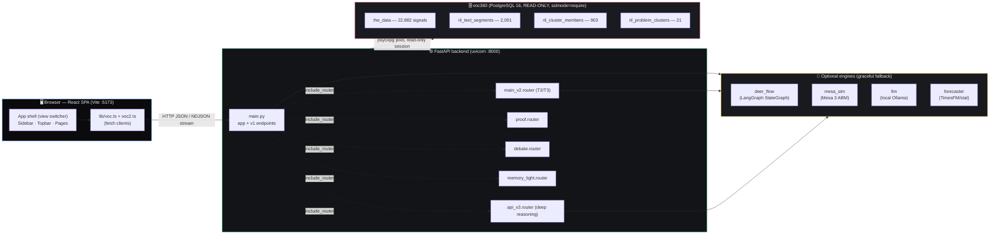
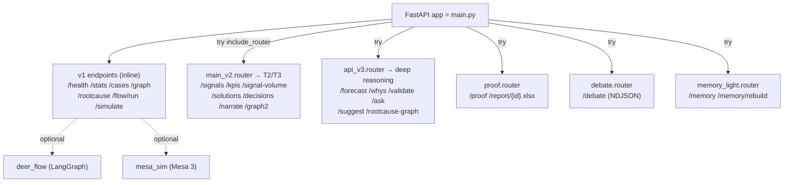
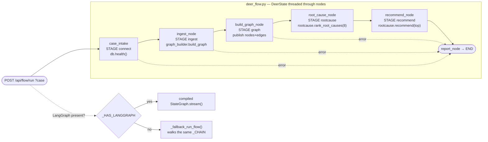
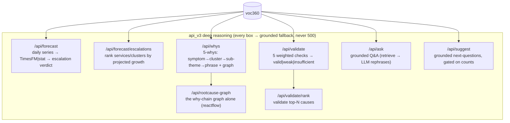
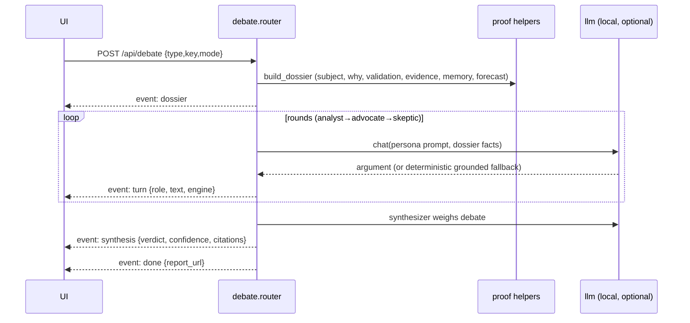
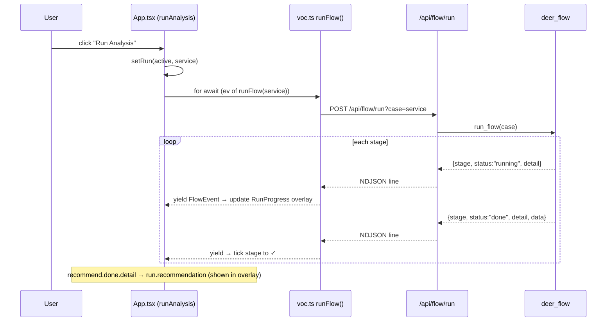
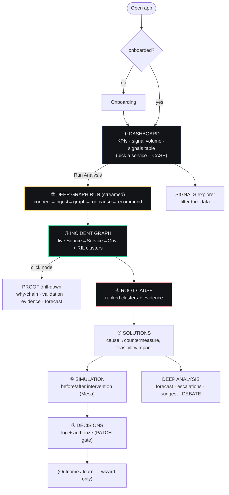

# AEGIS Crisis Console — System Workflow Map

> **Purpose of this document.** A single, inside-out reference of *how the running
> system actually works* — every layer, module, endpoint, data flow and fallback —
> written so you can **draw the full workflow visually**. Diagrams are in
> [Mermaid](https://mermaid.live) (paste any fenced `mermaid` block there to render/redraw)
> plus ASCII where a hand-drawing is easier to trace.
>
> Scope = the real code under [`backend/`](../backend) + [`frontend/`](../frontend) on the `dev`
> branch, not the aspirational blueprint docs. Where the blueprint and the code differ,
> this document follows the **code**.

---

## 0. One-paragraph mental model

The product is the **AEGIS Crisis Console**: a React command-center that connects to a live,
**read-only** Jordanian Voice-of-Customer Postgres database (**voc360**) and runs one
deterministic chain — **data source → dependency graph → root cause → recommendation** —
then layers deeper reasoning (forecast, 5-whys, validation, simulation, multi-agent debate)
on top. A FastAPI backend does all DB work and exposes ~30 JSON/NDJSON endpoints. Every
"smart" engine (LangGraph, Mesa, a local LLM, TimesFM) is **optional** and **degrades
gracefully** to a pure-Python equivalent, so the whole thing runs on a bare box with just
`fastapi + psycopg + numpy`.

---

## 1. Top-level system map



**Three processes, two you start:**

| Process | Command | Port | Needs |
|---|---|---|---|
| Frontend (Vite) | `cd frontend && npm run dev` | 5173 | Node; no backend required (has fallbacks) |
| Backend (uvicorn) | `cd backend && .venv/bin/uvicorn app.main:app --port 8000` | 8000 | `VOC_DSN` in `backend/.env` for real data |
| voc360 DB | *external, hosted* | 5432 | credentials (the `.env` DSN) |

---

## 2. The data source — voc360 and the core chain

Everything traces back to **four real tables**. The pipeline's whole job is to walk this chain:

```
   SIGNAL layer            SEGMENT layer         CLUSTER (root-cause) layer
 ┌───────────────┐      ┌──────────────────┐   ┌────────────────────────┐
 │   the_data    │      │ ril_text_segments│   │  ril_problem_clusters  │
 │  22,882 rows  │      │   2,001 problem  │   │   21 clusters (20 with │
 │               │      │     segments     │   │      members)          │
 │ source_type   │      │ segment_id       │   │ cluster_id             │
 │ service_id    │      │ record_id ✗──────┼─┐ │ canonical_label_ar     │
 │ governorate   │      │ segment_text     │ │ │ canonical_label_en     │
 │ severity      │      │ confidence       │ │ │ member_count (551,69…) │
 │ sentiment_lbl │      └──────────────────┘ │ │ severity_avg (~0.40)   │
 │ text/_clean   │           │ member_of     │ │ status, first/last_seen│
 │ observed_at…  │           ▼               │ └────────────────────────┘
 └───────────────┘      ┌──────────────────┐ │            ▲ part_of
        ▲               │ril_cluster_members│ │            │ (parent_cluster_id,
        │               │   903 rows        │─┘            │  currently flat)
        │               │ segment_id→cluster│
        │               │ distance_to_centroid
        │               └──────────────────┘
        │
   ⚠️ KEY CAVEAT: ril_text_segments.record_id does NOT join the_data
   (RIL ran on a separate snapshot). The two layers are PARALLEL.
   → cluster_link.py recovers the bridge BY TEXT (segment_text ⊂ the_data.text).
```

**The live graph built from this (the thing rendered on screen):**

```
 Source(source_type) --count--> Service(service_id) --count--> Governorate
        each signal carries severity + sentiment
 Segment --member_of--> ProblemCluster   (the root-cause layer)
 ROOT CAUSE = dominant ProblemCluster(s), ranked by member_count × (0.5 + severity_avg)
```

A **CASE** = a service, a governorate, or an emerging problem cluster.
The canonical flow: **connect → pull signals → build graph → rank root-cause clusters → recommend.**

Full column reference: [`docs/VOC360_SCHEMA.md`](VOC360_SCHEMA.md).

---

## 3. Backend architecture

### 3.1 App composition & the "graceful degradation" spine

[`main.py`](../backend/app/main.py) builds the FastAPI `app`, configures CORS for
`localhost/127.0.0.1/0.0.0.0`, defines the **v1** endpoints inline, then *optionally* mounts
five routers — **each inside its own `try/except`** so a missing/broken module never takes
the app down:



> **Degradation pattern (memorize this — it repeats everywhere):** every advanced capability
> is imported behind `try/except` into a `_HAS_X` flag. If absent, an **inline pure-Python
> implementation grounded in the same DB rows** runs instead. Endpoints are wrapped so they
> **never 500** — they return a well-formed `source: "fallback"` / `engine: "..."` honesty flag.

### 3.2 The data layer — `db.py`

- Read-only **connection pool** (`psycopg_pool`, `default_transaction_read_only=on`), reused
  across queries to avoid the ~1–2 s SSL handshake. Falls back to per-query connections.
- Three primitives the whole backend uses: `db.fetchall(sql, params)`, `db.fetchone(...)`,
  `db.health()`. DSN comes from `VOC_DSN` (env / `.env`). **No credentials in code.**

### 3.3 Backend module catalog

| Module | Layer | Role |
|---|---|---|
| [`main.py`](../backend/app/main.py) | app | FastAPI app, CORS, v1 endpoints, inline flow + sim fallbacks |
| [`db.py`](../backend/app/db.py) | data | read-only pooled voc360 access |
| [`graph_builder.py`](../backend/app/graph_builder.py) | graph | builds Source→Service→Governorate + RIL cluster graph (nodes/edges/tones/layout) |
| [`graph_real.py`](../backend/app/graph_real.py) | graph | **T1** augments the graph with *recovered* `service→cluster` edges (no keyword guess) |
| [`cluster_link.py`](../backend/app/cluster_link.py) | graph | **T1** recovers segment↔signal bridge **by text match**, caches to `backend/data/` |
| [`rootcause.py`](../backend/app/rootcause.py) | reason | ranks clusters by `member_count × (0.5 + severity_avg)` + sample evidence |
| [`rootcause_graph.py`](../backend/app/rootcause_graph.py) | reason | projects a why-chain into a reactflow root-cause tree |
| [`deer_flow.py`](../backend/app/deer_flow.py) | orchestration | **LangGraph StateGraph** running connect→ingest→graph→rootcause→recommend (+ pure-Python fallback runner) |
| [`mesa_sim.py`](../backend/app/mesa_sim.py) | simulation | **Mesa 3 ABM** of sentiment propagation + before/after intervention (+ numpy fallback) |
| [`forecaster.py`](../backend/app/forecaster.py) | reason | per-service/cluster volume & sentiment forecast (TimesFM→Holt-Winters→seasonal-naive) |
| [`series.py`](../backend/app/series.py) | reason | dense gap-filled daily series builder (input to forecaster) |
| [`whys.py`](../backend/app/whys.py) | reason | grounded **5-Whys** chain: symptom→cluster→sub-theme→phrase + graph |
| [`subthemes.py`](../backend/app/subthemes.py) | reason | Arabic-aware keyword/bigram sub-theme extractor (stdlib only) |
| [`validate.py`](../backend/app/validate.py) | reason | scores a cluster on 5 weighted checks → `valid/weak/insufficient` |
| [`qa.py`](../backend/app/qa.py) | reason | grounded Q&A (retrieve facts → LLM only rephrases) |
| [`suggest.py`](../backend/app/suggest.py) | reason | grounded "suggested questions" gated on real counts |
| [`solutions.py`](../backend/app/solutions.py) | reason | cause→countermeasure engine (keyword→action map, feasibility/impact) |
| [`decisions.py`](../backend/app/decisions.py) | state | append-only operator decision log (process-local) |
| [`proof.py`](../backend/app/proof.py) | compose | assembles the full **proof bundle** + streams a 4-sheet `.xlsx` report |
| [`debate.py`](../backend/app/debate.py) | compose | multi-agent **debate** (analyst/advocate/skeptic/synthesizer), NDJSON stream |
| [`memory_light.py`](../backend/app/memory_light.py) | memory | LightMem-style consolidated topic memory per cluster |
| [`llm.py`](../backend/app/llm.py) | narration | local-model client; **only phrases retrieved facts, never invents** |
| [`api_kpis.py`](../backend/app/api_kpis.py) | data | dashboard KPI aggregates + signal-volume series |
| [`api_signals.py`](../backend/app/api_signals.py) | data | paginated/filtered `the_data` feed |
| [`api_v3.py`](../backend/app/api_v3.py) | router | mounts forecast/whys/validate/ask/suggest with inline fallbacks |
| [`main_v2.py`](../backend/app/main_v2.py) | router | mounts signals/kpis/volume/solutions/decisions/narrate/graph2; holds the **AR→EN label table** |

### 3.4 The graph builder — node & edge taxonomy (draw this!)

[`graph_builder.build_graph(case)`](../backend/app/graph_builder.py) is the heart of the visual.
It runs 4 column-grounded SELECTs (top-16 services by volume) and emits a node-link graph laid
out in **vertical layers by x-coordinate**:

```
 x=40        x=320        x=660           x=1000              x=1300
 ┌──────┐   ┌────────┐   ┌──────────┐   ┌─────────────┐    ┌──────────┐
 │ CASE │──▶│ SOURCE │──▶│ SERVICE  │──▶│ GOVERNORATE │    │ CLUSTER  │
 │ root │   │app_rev │   │  Sanad   │   │  الزرقاء     │    │ رسوم…    │
 └──────┘   │social… │   │Amman Bus │   └─────────────┘    └──────────┘
     │      └────────┘   └──────────┘                          ▲
     │ kind=channel  kind=reports  kind=affects                │ kind=cluster
     │                                  ▲                       │
     │                                  │ kind=root_cause       │
     └──────────────── kind=diagnoses ──┴──▶ ┌──────────────┐──┘
                                              │ RCHUB        │
                                              │ "Root Causes │
                                              │  · RIL"      │  (x=1000)
                                              └──────────────┘
```

**Node types** (`type` field): `case`, `source`, `service`, `governorate`, `rchub`, `cluster`.
**Edge kinds** (`kind` field): `channel` (case→source), `reports` (source→service),
`affects` (service→gov), `diagnoses` (case→rchub), `cluster` (rchub→cluster),
`root_cause` / `root_cause_real` (service→cluster).

**Severity tone** per node (drives colour): `alert` / `warn` / `calm` / `neutral`, computed from
`bad/tot` severity ratio (service) or `severity_avg` (cluster):

```
 service tone:  ratio≥0.30 → alert    ratio≥0.10 → warn   else calm
 cluster tone:  sev≥0.50  → alert     sev≥0.30  → warn   else calm
```

**Service→Cluster edges** are recovered **for real** when `cluster_link` is available
(`kind:"root_cause"`, weight = distinct bridging records); otherwise an **Arabic-keyword
heuristic** (`_match_service`) draws a best-guess edge. `graph_real.augment_graph_real` adds the
stronger `kind:"root_cause_real"` edges + per-cluster `signal_count` (exposed at `/api/graph2`).

### 3.5 The root-cause ranking formula (one line, everywhere)

```
score(cluster) = member_count × (0.5 + severity_avg)
```

The **0.5 floor matters** because `severity_avg` is near-flat (~0.40) across clusters, so without
it the ranking would collapse to pure `member_count`. `rootcause.recommend(top)` then drafts the
operator sentence. Top real clusters: *urgent-service fees (551)*, *National-Aid-Fund delays (69)*,
*BRT bus (64)*, *Takaful platform (55)*, *service-center quality (52)*, *road excavations (23)*.

### 3.6 The Deer Graph flow (the streamed pipeline)

`POST /api/flow/run` streams **NDJSON FlowEvents**, one `running`+`done` pair per stage. Two
runners, identical output:



- **FlowEvent shape:** `{stage, status:"running"|"done", detail, data?}`.
- Stage ids the frontend reads: `connect → ingest → graph → rootcause → recommend` (+ `error`).
- `DEER_FLOW_TICK` (default 0.12 s) paces stages so the live canvas can animate each layer.
- The inline `_flow()` in `main.py` is a *third* fallback if `deer_flow` itself can't import.

### 3.7 The v3 deep-reasoning engines

All under [`api_v3.py`](../backend/app/api_v3.py); each has an **inline grounded fallback**:



**Validation's 5 checks** (weights): `coverage 0.30` · `evidence_sufficiency 0.20` ·
`temporal_trend 0.20` · `sim_impact 0.20` (calls `mesa_sim`) · `symptom_vs_cause 0.10`.
Verdict `valid` needs score ≥ 65, coverage+evidence pass, and ≥3 checks passing.

### 3.8 Proof bundle & report (composition, not new reasoning)

`GET /api/proof` **composes** the existing engines into one bundle; `GET /api/report/{id}.xlsx`
streams a 4-sheet Excel (Summary / Why-Chain / Evidence / Related Cases, Arabic-safe via openpyxl):

```
 /api/proof  ─→  _resolve_cluster(type,key)
                 ├─ subject      (cluster row + recovered services + signals)
                 ├─ why_chain    (whys.ask_whys)
                 ├─ validation   (api_v3 validate)
                 ├─ evidence     (representative segment_text quotes)
                 ├─ related_cases(real the_data rows)
                 ├─ forecast     (api_v3 forecast)
                 └─ plain (Arabic) + narration (LLM-phrased) + report_url
```

### 3.9 Multi-agent debate (a "society of agents")

`POST /api/debate` streams NDJSON as four Arabic personas argue over **one shared grounded
dossier** (built from the proof helpers + LightMem memory), then a synthesizer lands a verdict:



`mode:"deep"` fans out across the top-K clusters (delegates + expert panel) before synthesis.

### 3.10 Mesa simulation (agent-based sentiment propagation)

[`mesa_sim.py`](../backend/app/mesa_sim.py) builds a **networkx DiGraph** from live voc360
(`src→svc→gov` + `cluster→svc` bridge), seats one `NodeAgent` per node on a Mesa `NetworkGrid`,
and propagates sentiment each step:

```
 per agent, per step:
   1. inflow   = root-cause nodes gain sentiment ∝ (0.5+severity)×(1−intervention)
   2. contagion= pull toward weighted-neighbour mean (edge weight, log-compressed)
   3. decay    = sentiment × 0.985 toward calm
 reporters: mean_negativity · complaint_volume(Σ sentiment×volume) · n_critical(>0.7)
```

`run_before_after` runs the **same seed twice** (no intervention vs damp the top root-cause node)
→ `{before, after, delta, root_cause}`. `POST /api/simulate` calls this; if Mesa/networkx absent,
a numpy/plain-python `_FallbackModel` reproduces the identical 3-series schema; if *that* path
isn't reached, `main.py` has its own inline risk-curve fallback.

---

## 4. Complete API endpoint catalog

> Base URL defaults to `http://<host>:8000`. The frontend client picks it from `VITE_API`
> or `window.location.hostname:8000`.

| # | Method | Path | Returns | Backed by | Fallback flag |
|---|---|---|---|---|---|
| 1 | GET | `/api/health` | DB connectivity | `db.health` | `{ok:false,error}` |
| 2 | GET | `/api/stats` | row counts | `db` | — |
| 3 | GET | `/api/cases` | services + top root causes | `db` + `rootcause` | `EMPTY_CASES` |
| 4 | GET | `/api/graph?case=` | live dependency graph | `graph_builder` | — |
| 5 | GET | `/api/graph2?case=` | graph + **recovered** RC edges | `graph_builder`+`graph_real` | `real_source:none` |
| 6 | GET | `/api/rootcause?limit=` | ranked clusters + recommendation | `rootcause` | — |
| 7 | POST | `/api/flow/run?case=` | **NDJSON** stream (Deer Graph) | `deer_flow` → inline | inline `_flow` |
| 8 | POST | `/api/simulate?case=&steps=` | before/after sim | `mesa_sim` → inline | inline risk curve |
| 9 | GET | `/api/signals` | paginated `the_data` feed | `api_signals` | direct SQL / empty |
| 10 | GET | `/api/kpis` | dashboard KPI cards | `api_kpis` | `_kpis_direct` / fallback |
| 11 | GET | `/api/signal-volume?bucket=` | time-bucketed volume | `api_kpis` / direct | dow / empty |
| 12 | GET | `/api/solutions?limit=` | cause→countermeasure | `solutions` → inline | engine/fallback |
| 13 | GET | `/api/decisions` | decision log | `decisions` / JSON store | store |
| 14 | POST | `/api/decisions` | append decision | `decisions` / JSON store | `{ok:false}` |
| 15 | PATCH | `/api/decisions/{id}` | transition status (auth gate) | `decisions` / JSON store | `{ok:false}` |
| 16 | POST | `/api/narrate` | LLM narration | `llm` → local → grounded | `engine:"fallback"` |
| 17 | GET | `/api/forecast` | volume/sentiment forecast | `forecaster` → inline | `source` flag |
| 18 | GET | `/api/forecast/escalations` | escalation watchlist | `forecaster` / inline | — |
| 19 | GET | `/api/forecast/status` | which backend is active | `forecaster` | inline-stat |
| 20 | POST | `/api/whys` | 5-whys chain + graph | `whys` → inline | `method:"inline"` |
| 21 | GET | `/api/rootcause-graph` | why-chain graph (reactflow) | `whys` builder | `graph_builder` |
| 22 | GET | `/api/validate` | root-cause verdict | `validate` → inline | `engine:"validate"` |
| 23 | GET | `/api/validate/rank` | validate top-N | `validate` | — |
| 24 | POST | `/api/ask` | grounded Q&A | `qa` → inline | `grounded:false` |
| 25 | GET | `/api/suggest` | suggested questions | `suggest` → inline | suggest-inline |
| 26 | GET | `/api/proof` | full proof bundle | `proof` (composes) | per-piece defaults |
| 27 | GET | `/api/report/{id}.xlsx` | Excel report | `proof` + openpyxl | — |
| 28 | POST | `/api/debate` | **NDJSON** agent debate | `debate` + `proof` + `llm` | `engine:"grounded"` |
| 29 | GET | `/api/memory` · POST `/api/memory/rebuild` | topic memory | `memory_light` | — |
| 30 | GET | `/api/v3/health` | v3 surface + engine flags | `api_v3` | — |

---

## 5. Frontend architecture

### 5.1 Entry & app shell (what's actually wired)

```
 main.tsx ──renders──▶ <App/>      (NOTE: router.tsx is NOT used — see §5.5)
                          │
        ┌─────────────────┼──────────────────────────────┐
        ▼                 ▼                               ▼
   <Sidebar/>        <Topbar/>                  view switch (useState 'view')
   nav + cases      search + bell                        │
                                   ┌───────────────────────┴───────────────┐
                                   ▼ (one of 8 views, lazy-loaded)          │
   Dashboard · Incident Graph · Signals · Root Cause · Solutions ·         │
   Simulation · Decisions · Deep Analysis                                  │
                                   │                                        │
              <RunProgress/> overlay  ◀── streamed Deer Graph run ──────────┘
              <SettingsDrawer/> <HelpDrawer/> <Onboarding/> <ErrorBoundary/>
```

The active app ([`App.tsx`](../frontend/src/App.tsx)) is a **single-component view switcher**
(`switch(view)`), **not** React Router. State lives in `useState` (services, activeService, run,
search). First-visit `<Onboarding/>` gates on `localStorage`.

### 5.2 The two fetch clients

- [`lib/voc.ts`](../frontend/src/lib/voc.ts) — v1 + advanced: `getGraph`, `getRootCause`,
  `getStats`, `getHealth`, `getSimulate`, `runFlow` (NDJSON async generator), `getProof`,
  `streamDebate` (NDJSON), `getWhys`, `getForecast`, `getValidate`, `reportUrl`. Throws on HTTP error.
- [`lib/voc2.ts`](../frontend/src/lib/voc2.ts) — console data, **never throws** (returns a
  fallback so pages stay mounted): `getSignals`, `getKpis`, `getSignalVolume`, `getCases`,
  `getSolutions`, `getDecisions`, `createDecision`, `updateDecision`, `narrate`. Also exports the
  AEGIS colour tokens + tone helpers. `voc.ts` re-exports all of `voc2.ts`.

### 5.3 Page → endpoint map (draw the columns!)

| View (sidebar) | Component | Endpoints consumed |
|---|---|---|
| **Dashboard** | `DashboardView` (in App.tsx) | `/api/kpis`, `/api/cases`, `/api/signal-volume`, `/api/signals` (table), `/api/flow/run` (Run Analysis) |
| **Incident Graph** | `LiveGraph` | `/api/cases`, `/api/graph`, `/api/health`, `/api/rootcause`, `/api/simulate`, `/api/flow/run` |
| **Signals** | `SignalsPage` | `/api/signals` |
| **Root Cause** | `RootCausePage` | `/api/rootcause` |
| **Solutions** | `SolutionsPage` | `/api/solutions`, `/api/rootcause`, `/api/decisions` (GET+POST) |
| **Simulation** | `SimulationPage` | `/api/simulate` |
| **Decisions** | `DecisionsPage` | `/api/decisions` (GET + PATCH auth gate) |
| **Deep Analysis** | `DeepAnalysisPage` | `/api/rootcause`, `/api/forecast`, `/api/forecast/escalations`, `/api/suggest`, `/api/debate` (stream) |

### 5.4 The live "Run Analysis" sequence (the streaming UX)



### 5.5 The alternate (currently unused) wizard router

[`router.tsx`](../frontend/src/router.tsx) defines a **second**, route-based page set under
`/case/:id/{graph,root-cause,solutions,sim,decide,outcome}` with its own components
(`IncidentGraph`, `RootCause`, `Solutions`, `Simulation`, `DecisionHub`, `Outcome`, `SignalExplorer`)
and `stores/{appStore,wizardStore,themeStore}.ts`. **`main.tsx` does not mount this router** — it
renders `App` directly. Treat this as a parallel/legacy "wizard" implementation (and the
`zarqa-2025-08` demo fixtures in `lib/data.ts`) when mapping the live workflow.

---

## 6. End-to-end: the operator's journey (the master workflow)



This mirrors the blueprint loop **Ingest → Resolve → Correlate → Root-Cause → Risk →
Generate-Solution → Validate → Recommend → Learn**, as realized in code.

---

## 7. Degradation matrix (what happens when X is missing)

| If this is unavailable… | The system… | Honesty flag |
|---|---|---|
| `VOC_DSN` / DB down | `/api/health` → `{ok:false}`; data endpoints return grounded fallbacks/empties | `source:"fallback"`, `connected:false` |
| **LangGraph** | `/api/flow/run` uses `_fallback_run_flow` (same stages) | identical FlowEvents |
| **Mesa / networkx** | `/api/simulate` uses numpy `_FallbackModel`; then inline risk curve | `engine:"fallback"` |
| **Local LLM (Ollama)** | narration/debate use deterministic grounded summaries | `engine:"fallback"`/`"grounded"` |
| **TimesFM / torch** | forecaster uses Holt-Winters → seasonal-naive → flat | `source:"seasonal-naive"` |
| `cluster_link` cache | graph falls back to Arabic-keyword `root_cause` edges | `kind:"root_cause"` vs `"root_cause_real"` |
| A whole router fails to import | `main.py` skips it; rest of API works | endpoint simply absent |

> **Trust boundary (load-bearing):** the LLM **only rephrases facts already retrieved from voc360**.
> It never produces a count, label, cause, or verdict. If it drifts or is down, the deterministic
> `summary` *is* the answer.

---

## 8. Tech stack — actual vs aspirational

**Actually running (this repo):**

| Layer | What's in the code |
|---|---|
| Frontend | React **19** + TypeScript · Vite **8** · Tailwind **3** · `@xyflow/react`/`reactflow` · Recharts · Framer Motion (`motion`) · lucide-react · Zustand (wizard only) |
| Backend | Python 3.13 · FastAPI 0.115 · Pydantic v2 · psycopg 3 (+pool) · uvicorn |
| Optional engines | LangGraph 0.2 · Mesa 3.1 · networkx · numpy · openpyxl · local Ollama LLM · (TimesFM env-gated) |
| Data | PostgreSQL 16 (voc360), **read-only** |

**Aspirational (blueprint docs, not all wired):** Apache AGE, pgvector, PostGIS, TimescaleDB,
Redis, S3/MinIO, Splink/dedupe, DoWhy/PyRCA, OR-Tools, MapLibre, OAuth2/OIDC+RBAC, OpenTelemetry.
See [`docs/TECH_STACK.md`](TECH_STACK.md) and [`docs/GENERAL_CRISIS_BRAIN_BLUEPRINT.md`](GENERAL_CRISIS_BRAIN_BLUEPRINT.md).

---

## 9. Glossary (for diagram labels)

| Term | Meaning |
|---|---|
| **voc360** | the live Jordanian Voice-of-Customer Postgres DB (read-only data source) |
| **Signal** | one `the_data` row (a citizen complaint/review/survey) |
| **Segment** | an extracted problem phrase (`ril_text_segments`) |
| **Cluster / Problem Cluster** | a grouped root-cause theme (`ril_problem_clusters`) |
| **CASE** | a chosen scope: a service, governorate, or cluster |
| **Deer Graph** | the LangGraph-style staged flow connect→ingest→graph→rootcause→recommend |
| **RCHUB** | the synthetic "Root Causes · RIL" hub node linking the case to its clusters |
| **Tone** | severity colour token: `alert`/`warn`/`calm`/`neutral` (backend) ↔ `danger`/`good`/`warn`/`neutral` (UI) |
| **T1/T2/T3** | build tracks: T1 graph/recovered edges · T2 console data (signals/kpis/decisions) · T3 LLM reasoning/solutions |
| **Honesty flag** | `source`/`engine` field telling the UI whether data is real, engine-derived, or fallback |

---

### Appendix A — Reference reading order for a deep dive

1. [`docs/VOC360_SCHEMA.md`](VOC360_SCHEMA.md) — the data model (read first)
2. [`backend/app/graph_builder.py`](../backend/app/graph_builder.py) — the visual graph
3. [`backend/app/deer_flow.py`](../backend/app/deer_flow.py) — the staged flow
4. [`backend/app/rootcause.py`](../backend/app/rootcause.py) + [`mesa_sim.py`](../backend/app/mesa_sim.py) — reasoning + simulation
5. [`frontend/src/App.tsx`](../frontend/src/App.tsx) + [`lib/voc.ts`](../frontend/src/lib/voc.ts) — the live UI + client
6. [`docs/DEER_GRAPH_SYSTEM.md`](DEER_GRAPH_SYSTEM.md) · [`docs/MESA_SIMULATION.md`](MESA_SIMULATION.md) · [`docs/V2_REAL_PIPELINE.md`](V2_REAL_PIPELINE.md)
</content>
</invoke>
